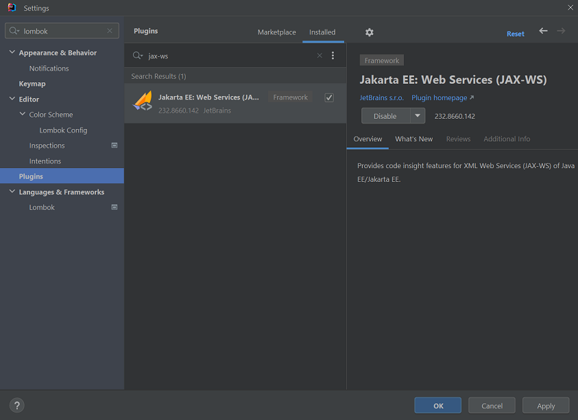

# Spring - SOAP Producer - Countries
Autor: Leonardo Simões


## Etapas do desenvolvimento
As etapas de desenvolvimento do projeto foram:

1. Criar projeto (no IntelliJ) com:
- Linguagem Java (17);
- Spring Framework (6.2.3);
- Dependências: Web, Web Services, DevTools, Lombok;
- Plugins: Lombok e Jakarta EE: Web-Services (JAX-WS).




2. Em `src/main/resources`, criar arquivo `countries.xsd` para as definições para Country.

3. Em `pom.xml` adicionar as dependências e o plugin:

```xml
<project>
    <dependencies>
        <dependency>
            <groupId>wsdl4j</groupId>
            <artifactId>wsdl4j</artifactId>
            <version>1.6.3</version>
        </dependency>
        <dependency>
            <groupId>jakarta.xml.bind</groupId>
            <artifactId>jakarta.xml.bind-api</artifactId>
            <version>4.0.2</version>
        </dependency>
        <dependency>
            <groupId>org.glassfish.jaxb</groupId>
            <artifactId>jaxb-runtime</artifactId>
            <version>4.0.5</version>
        </dependency>
    </dependencies>
    <build>
        <plugins>
            <plugin>
                <groupId>org.codehaus.mojo</groupId>
                <artifactId>jaxb2-maven-plugin</artifactId>
                <version>3.1.0</version>
                <executions>
                    <execution>
                        <id>xjc</id>
                        <goals>
                            <goal>xjc</goal>
                        </goals>
                    </execution>
                </executions>
                <configuration>
                    <sources>
                        <source>${project.basedir}/src/main/resources/countries.xsd</source>
                    </sources>
                </configuration>
            </plugin>
        </plugins>
    </build>
</project>
```


## Referências
Spring - Guides - Producing a SOAP web service:
https://spring.io/guides/gs/producing-web-service

Baeldung - Creating a SOAP Web Service with Spring:
https://www.baeldung.com/spring-boot-soap-web-service

Baeldung - Invoking a SOAP Web Service in Java:
https://www.baeldung.com/java-soap-web-service

Baeldung - Introduction to JAX-WS:
https://www.baeldung.com/jax-ws

MVN Repository - WSDL4J:
https://mvnrepository.com/artifact/wsdl4j/wsdl4j

MVN Repository - JAXB Core:
https://mvnrepository.com/artifact/org.glassfish.jaxb/jaxb-core

MVN Repository - JAXB Runtime:
https://mvnrepository.com/artifact/org.glassfish.jaxb/jaxb-runtime/

MVN Repository - Jakarta Activation API:
https://mvnrepository.com/artifact/jakarta.activation/jakarta.activation-api