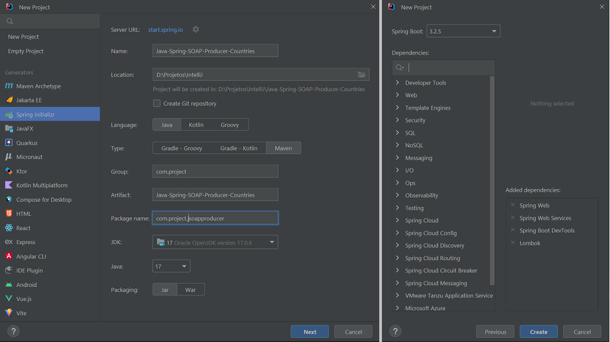
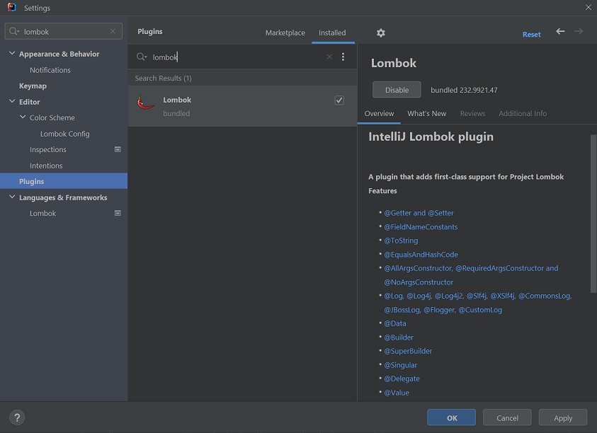
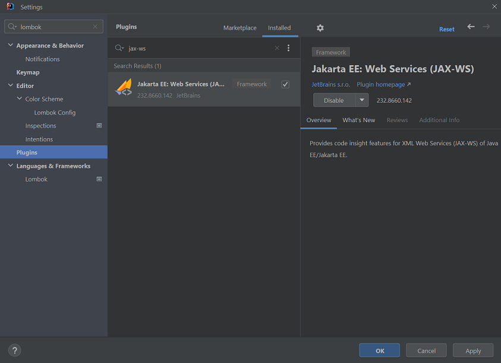

# Spring - SOAP Producer - Countries
Author: Leonardo Simões

## Development steps
The steps of project implementation:

1. Create project (in IntelliJ) with:
- Java language (17);
- Spring Framework (6.2.3);
- Dependencies: Web, Web Services, DevTools and Lombok;
- Plugins: Lombok and Jakarta EE: Web-Services (JAX-WS).

2. In `src/main/resources`, create `countries.xsd` file for Country definitions.

## References
Spring - Guides - Producing a SOAP web service:
https://spring.io/guides/gs/producing-web-service

Baeldung - Creating a SOAP Web Service with Spring:
https://www.baeldung.com/spring-boot-soap-web-service

Baeldung - Invoking a SOAP Web Service in Java:
https://www.baeldung.com/java-soap-web-service

Baeldung - Introduction to JAX-WS:
https://www.baeldung.com/jax-ws

MVN Repository - WSDL4J:
https://mvnrepository.com/artifact/wsdl4j/wsdl4j

MVN Repository - JAXB Core:
https://mvnrepository.com/artifact/org.glassfish.jaxb/jaxb-core

MVN Repository - JAXB Runtime:
https://mvnrepository.com/artifact/org.glassfish.jaxb/jaxb-runtime/

MVN Repository - Jakarta Activation API:
https://mvnrepository.com/artifact/jakarta.activation/jakarta.activation-api