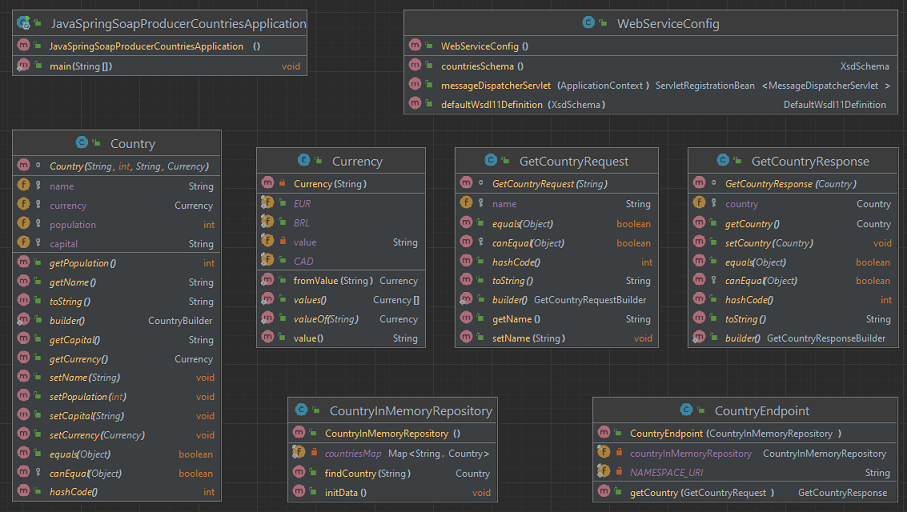
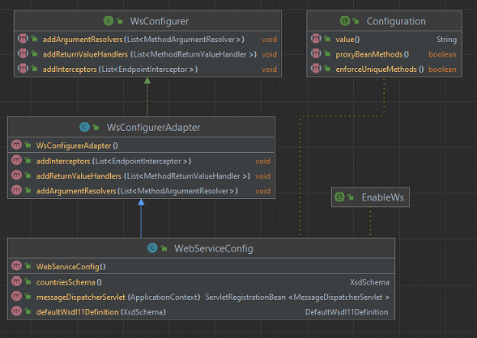

# Spring - SOAP Producer - Countries
Author: Leonardo Simões

The Namespace URI must be the same for:
- the `xmlns:tns` and `targetNamespace` fields of `countries.xsd`;
- the `NAMESPACE_URI` attribute in `CountryEndpoint`;
- the `wsdl11Definition.setTargetNamespace` parameter within the `defaultWsdl11Definition` method of `WebServiceConfig`;




## Development steps
The steps of project implementation:

1. Create project (in IntelliJ) with:
- Java language (17);
- Spring Framework (6.2.3);
- Dependencies: Web, Web Services, DevTools and Lombok;
- Plugins: Lombok and Jakarta EE: Web-Services (JAX-WS).


2. In `src/main/resources`, create `countries.xsd` file for Country definitions.

3. In `pom.xml` add the dependencies and the plugin:

```xml
<project>
    <dependencies>
        <dependency>
            <groupId>wsdl4j</groupId>
            <artifactId>wsdl4j</artifactId>
            <version>1.6.3</version>
        </dependency>
        <dependency>
            <groupId>jakarta.xml.bind</groupId>
            <artifactId>jakarta.xml.bind-api</artifactId>
            <version>4.0.2</version>
        </dependency>
        <dependency>
            <groupId>org.glassfish.jaxb</groupId>
            <artifactId>jaxb-runtime</artifactId>
            <version>4.0.5</version>
        </dependency>
    </dependencies>
    <build>
        <plugins>
            <plugin>
                <groupId>org.codehaus.mojo</groupId>
                <artifactId>jaxb2-maven-plugin</artifactId>
                <version>3.1.0</version>
                <executions>
                    <execution>
                        <id>xjc</id>
                        <goals>
                            <goal>xjc</goal>
                        </goals>
                    </execution>
                </executions>
                <configuration>
                    <sources>
                        <source>${project.basedir}/src/main/resources/countries.xsd</source>
                    </sources>
                </configuration>
            </plugin>
        </plugins>
    </build>
</project>
```

4. Create classes `Country`, `Currency`, `GetCountryRequest` and `GetCountryResponse` using the Maven plugin (or GPT chat):


5. Create class `CountryInMemoryRepository`:
- with the static attribute `countriesMap`;
- with the `initData()` method annotated with `@PostConstruct` to initialize `countriesMap`;
- with the `findCountry(String name)` method.


6. Create class `CountryEndpoint`:
- with the static attribute `NAMESPACE_URI`;
- with the `CountryInMemoryRepository` attribute initialized in the constructor which is annotated with `@Autowired`;
- with the `getCountry` method:
    * annotated with `@PayloadRoot` and `@ResponsePayload`;
    * with argument `getCountryRequest` annotated with `RequestPayload`.


7. Create class `WebServiceConfig`:
- extends `WsConfigurerAdapter`;
- annotated with `@EnableWs` and `@Configuration`;
- with the 3 methods annotated with `@Bean`.



8. Change Namespace URI to `"http://spring.io/guides/gs-producing-web-service"` at:
- `xmlns:tns` and `targetNamespace` fields from `countries.xsd`;
- `NAMESPACE_URI` attribute in `CountryEndpoint`;
- `wsdl11Definition.setTargetNamespace` parameter within the `defaultWsdl11Definition` method of `WebServiceConfig`;

9. Refactor the code to comply with the SOAP contract
- manually delete the `GetCountryRequest` and `GetCountryResponse` classes, which were also generated manually.
- separate the `Country` class into `Country` (automatically generated) and `CountryEntity`;
- create the `CountryMapper` class to convert from `CountryEntity` to `Country`;
- change the `CountryEndpoint` class to use the automatically generated versions of `GetCountryRequest` and `GetCountryResponse`.

10. Test the application with POSTMAN:
- HTTP POST request;
- with URI `http://localhost:8080/ws`;
- the body content must be RAW/XML:

```xml
<soapenv:Envelope xmlns:soapenv="http://schemas.xmlsoap.org/soap/envelope/"
				  xmlns:gs="http://spring.io/guides/gs-producing-web-service">
   <soapenv:Header/>
   <soapenv:Body>
      <gs:getCountryRequest>
         <gs:name>Portugal</gs:name>
      </gs:getCountryRequest>
   </soapenv:Body>
</soapenv:Envelope>
```


## References
Spring - Guides - Producing a SOAP web service:
https://spring.io/guides/gs/producing-web-service

Baeldung - Creating a SOAP Web Service with Spring:
https://www.baeldung.com/spring-boot-soap-web-service

Baeldung - Invoking a SOAP Web Service in Java:
https://www.baeldung.com/java-soap-web-service

Baeldung - Introduction to JAX-WS:
https://www.baeldung.com/jax-ws

MVN Repository - WSDL4J:
https://mvnrepository.com/artifact/wsdl4j/wsdl4j

MVN Repository - JAXB Core:
https://mvnrepository.com/artifact/org.glassfish.jaxb/jaxb-core

MVN Repository - JAXB Runtime:
https://mvnrepository.com/artifact/org.glassfish.jaxb/jaxb-runtime/

MVN Repository - Jakarta Activation API:
https://mvnrepository.com/artifact/jakarta.activation/jakarta.activation-api